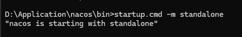

API开放平台

1. 打开nacos

startup.cmd -m standalone
2. 运行api-backend
3. 再运行api-gateway, api-interface

限流器实现
分布式的限流方法有三种：1. Redis实现 2. 阿里开源的Sentimental框架 3. google开源的goove框架

1. 启动redis
找到redis文件夹，运行命令启动redis。 redis-server.exe redis.windows.conf
